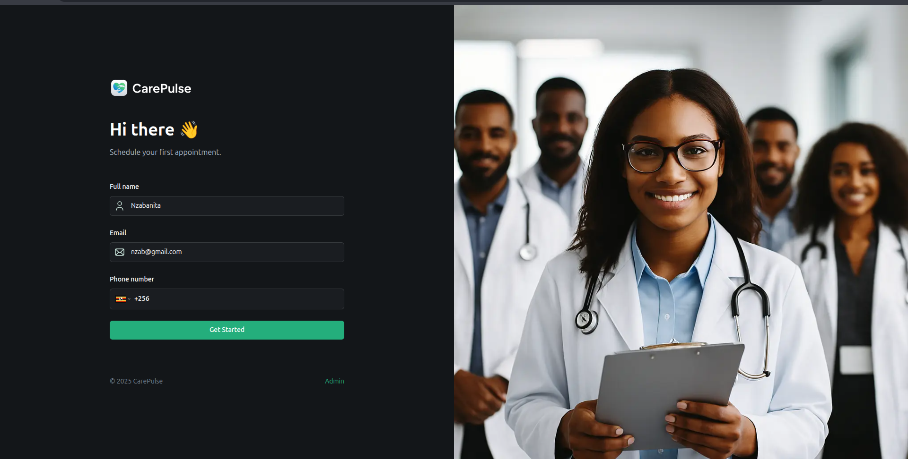

# CareSync 🩺

<p align="center"></p>

> A modern, user-friendly healthcare platform that streamlines patient registration, appointment scheduling, and medical records, and learn to implement complex forms and SMS notifications.

[](https://opensource.org/licenses/MIT) [](https://nextjs.org/) [](https://reactjs.org/) [](https://www.typescriptlang.org/) [](https://tailwindcss.com/) [](https://appwrite.io/) [](https://zod.dev/)

---

## ✨ Overview

CareSync is a web application built with the latest technologies to provide a seamless experience for patients and administrators in managing healthcare appointments. The project focuses on a clean, intuitive user interface and a robust backend to handle patient data securely and efficiently.

The current focus is on building a comprehensive patient onboarding form with reusable and scalable components.

<p align="center"></p>

## 🚀 Key Features

-   Patient Onboarding & Management: A comprehensive, multi-step form for patient registration.
-   Custom Form Fields: A reusable `CustomFormField` component designed to handle various input types, making it easy to extend the form.
-   Appointment Scheduling: An intuitive interface for patients to schedule appointments using a date and time picker.
-   Secure File Uploads: A drag-and-drop interface for patients to easily upload medical documents, such as physician's notes or lab results.
-   Schema-Based Validation: Uses `Zod` to define a validation schema, ensuring data integrity before submission.
-   Responsive Design: Fully responsive layout that works on all devices, from mobile phones to desktops.
-   Dark Mode: Beautiful dark theme for a comfortable user experience in low-light environments, powered by `next-themes`.
-   Comprehensive Admin Dashboard: A dedicated interface for healthcare providers to:
    -   View and manage patient data in a sortable, filterable table.
    -   Track key metrics with statistical cards.
    -   Update appointment statuses with clear visual badges.

## 🛠️ Tech Stack

-   Framework: Next.js 14 (with App Router)
-   Language: TypeScript
-   Backend: Appwrite
-   Messaging: Twilio SMS
-   Styling: Tailwind CSS
-   UI Components: shadcn/ui
-   Form Management: React Hook Form
-   Schema Validation: Zod
-   Date & Time: react-datepicker
-   Phone Input: react-phone-number-input
-   Theming: next-themes
-   Fonts: Custom Fonts (`Satoshi`, `Inter`)

## 🏗️ Architecture

CareSync is built with a focus on scalability, reusability, and a clean separation of concerns.

### Styling
-   Tailwind CSS with Custom Utilities: We leverage Tailwind's utility-first approach and extend it with custom, reusable classes in `globals.css` using the `@layer` directive. This includes helpers for layout (`.container`), typography (`.header`), and component-specific styles (`.admin-stat`, `.data-table`).
-   shadcn/ui Overrides: To maintain a consistent design language, we apply custom styles to our `shadcn/ui` components. These overrides (`.shad-*`) are centralized in `globals.css` for easy maintenance.

### Form Handling
-   Reusable Components: The `CustomFormField.tsx` and `FileUploader.tsx` components provide generic, reusable building blocks for forms. `CustomFormField` dynamically renders various input controls, while `FileUploader` offers a clean drag-and-drop zone, drastically reducing boilerplate.
-   Centralized Validation: `lib/validation.ts` contains all Zod schemas, providing a single source of truth for strongly-typed, declarative validation rules across the application.
-   Server Actions: Form submissions are handled by Next.js Server Actions, ensuring a seamless user experience without full-page reloads and keeping business logic on the server.

## 📦 Getting Started

Follow these instructions to get a copy of the project up and running on your local machine for development and testing purposes.

### Prerequisites

Make sure you have the following installed on your system:
-   Node.js (v18.x or later)
-   npm, yarn, or pnpm

### Installation & Setup

1.  Clone the repository:
    ```bash
    git clone https://github.com/paladin-2024/caresync.git
    cd caresync
    ```

2.  Install dependencies:
    ```bash
    npm install
    # or
    yarn install
    # or
    pnpm install
    ```

3.  Set up environment variables:
    Create a `.env.local` file in the root of the project and add any necessary environment variables.
    
    Example for Appwrite:
    ```env
    # .env.local
    NEXT_PUBLIC_ENDPOINT="https://cloud.appwrite.io/v1"
    NEXT_PUBLIC_PROJECT_ID="YOUR_PROJECT_ID"
    NEXT_PUBLIC_API_KEY="YOUR_API_KEY"
    NEXT_PUBLIC_DATABASE_ID="YOUR_DATABASE_ID"
    NEXT_PUBLIC_PATIENT_COLLECTION_ID="YOUR_PATIENT_COLLECTION_ID"
    ```

4.  Run the development server:
    ```bash
    npm run dev
    # or
    yarn dev
    # or
    pnpm dev
    ```

Open http://localhost:3000 with your browser to see the result.

## 📁 Project Structure
The project follows a standard Next.js App Router structure, with some conventions for organizing components and utilities.

## Developed by **Nzabanita**

